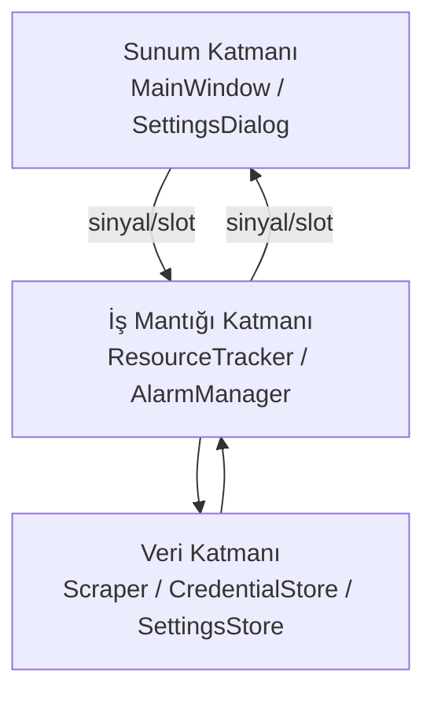
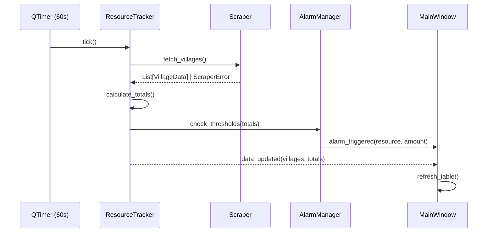

# Tasarım Belgesi: Wildguns Kaynak Takip ve Alarm Uygulaması

## Genel Bakış

Wildguns Kaynak Takip ve Alarm Uygulaması, `tr.wildguns.gameforge.com` adresindeki tarayıcı tabanlı strateji oyununun "Köy Genel Durum" sayfasını periyodik olarak web scraping yöntemiyle okur. Tüm köylerdeki odun, kil, demir ve yiyecek miktarlarını toplar; belirlenen eşik değerlerine ulaşıldığında sesli alarm çalar.

Uygulama Python ile geliştirilecektir. Masaüstü arayüzü için **PyQt6** kullanılacak; bu kütüphane Windows ve macOS'ta yerel görünüm sunar ve aktif olarak geliştirilmektedir. Web scraping için **requests** + **BeautifulSoup4** tercih edilecektir. Oturum yönetimi için **requests.Session** nesnesi kullanılacak; kimlik bilgileri işletim sisteminin güvenli deposuna **keyring** kütüphanesi aracılığıyla kaydedilecektir.

### Teknoloji Seçimleri

| Katman | Teknoloji | Gerekçe |
|---|---|---|
| Masaüstü UI | PyQt6 | Windows + macOS desteği, yerel widget'lar |
| HTTP / Scraping | requests + BeautifulSoup4 | Olgun, geniş topluluk desteği |
| Zamanlayıcı | QTimer (PyQt6) | UI thread ile entegre, thread-safe |
| Güvenli depolama | keyring | OS Keychain / Credential Manager soyutlaması |
| Kalıcı ayarlar | QSettings (PyQt6) | Çapraz platform INI/registry desteği |
| Ses | QSoundEffect (PyQt6) | Çapraz platform, düşük gecikme |
| Paketleme | PyInstaller | Tek çalıştırılabilir dosya üretimi |

---

## Mimari

Uygulama üç ana katmandan oluşur: **Veri Katmanı**, **İş Mantığı Katmanı** ve **Sunum Katmanı**. Katmanlar arası iletişim Qt sinyal/slot mekanizmasıyla sağlanır; bu sayede UI thread'i bloke edilmez.



### Bileşen Etkileşim Akışı



---

## Bileşenler ve Arayüzler

### Scraper

HTTP oturumu açar, oyun sayfasını indirir ve HTML tablosunu ayrıştırır.

```python
class Scraper:
    def login(self, username: str, password: str) -> bool: ...
    def fetch_villages(self) -> list[VillageData]: ...
    def is_logged_in(self) -> bool: ...
```

- `login()` başarısız olursa `AuthenticationError` fırlatır.
- `fetch_villages()` sayfa yüklenemezse `NetworkError`, tablo bulunamazsa `ParseError` fırlatır.
- Oturum çerezi geçersizleşirse `SessionExpiredError` fırlatır; `ResourceTracker` bu hatayı yakalayıp otomatik yeniden giriş dener.

### ResourceTracker

Zamanlayıcıyı yönetir, scraping döngüsünü koordine eder ve toplam hesaplamalarını yapar.

```python
class ResourceTracker(QObject):
    data_updated = pyqtSignal(list, ResourceTotals)   # villages, totals
    error_occurred = pyqtSignal(str)                   # hata mesajı
    refresh_started = pyqtSignal()
    refresh_finished = pyqtSignal(datetime)            # son güncelleme zamanı

    def start(self) -> None: ...
    def stop(self) -> None: ...
    def refresh_now(self) -> None: ...
    def calculate_totals(self, villages: list[VillageData]) -> ResourceTotals: ...
```

Scraping işlemi `QThread` içinde çalıştırılır; UI thread'i bloke edilmez.

### AlarmManager

Eşik kontrolü yapar ve alarm sesini çalar.

```python
class AlarmManager(QObject):
    alarm_triggered = pyqtSignal(str, int)   # kaynak_adı, miktar
    alarm_silenced = pyqtSignal(str)         # kaynak_adı

    def check_thresholds(self, totals: ResourceTotals) -> None: ...
    def silence(self, resource: str) -> None: ...
    def reset_silence(self, resource: str) -> None: ...
```

- Her kaynak için bağımsız "susturuldu" durumu tutulur.
- Kaynak miktarı eşiğin altına düşüp tekrar eşiğe ulaştığında susturma sıfırlanır.

### CredentialStore

İşletim sistemi güvenli deposunu soyutlar.

```python
class CredentialStore:
    SERVICE_NAME = "wildguns-tracker"

    def save(self, username: str, password: str) -> None: ...
    def load(self) -> tuple[str, str] | None: ...
    def delete(self) -> None: ...
```

`keyring` kütüphanesi kullanılır; macOS'ta Keychain, Windows'ta Credential Manager'a yazar.

### SettingsStore

Eşik değerlerini ve uygulama tercihlerini kalıcı olarak saklar.

```python
class SettingsStore:
    def get_threshold(self, resource: str) -> int | None: ...
    def set_threshold(self, resource: str, value: int | None) -> None: ...
    def get_all_thresholds(self) -> dict[str, int | None]: ...
```

`QSettings` kullanılır; Windows'ta registry, macOS'ta plist dosyasına yazar.

### MainWindow

Ana pencere; köy tablosunu, toplam satırını, eşik giriş alanlarını ve durum çubuğunu barındırır.

---

## Veri Modelleri

```python
from dataclasses import dataclass, field
from datetime import datetime

@dataclass
class VillageData:
    name: str
    wood: int
    clay: int
    iron: int
    food: int

@dataclass
class ResourceTotals:
    wood: int = 0
    clay: int = 0
    iron: int = 0
    food: int = 0

@dataclass
class ThresholdConfig:
    wood: int | None = None    # None = devre dışı
    clay: int | None = None
    iron: int | None = None
    food: int | None = None

@dataclass
class AppState:
    villages: list[VillageData] = field(default_factory=list)
    totals: ResourceTotals = field(default_factory=ResourceTotals)
    thresholds: ThresholdConfig = field(default_factory=ThresholdConfig)
    last_updated: datetime | None = None
    is_running: bool = False
    silenced_resources: set[str] = field(default_factory=set)
```

### Hata Hiyerarşisi

```python
class TrackerError(Exception): ...
class NetworkError(TrackerError): ...
class ParseError(TrackerError): ...
class AuthenticationError(TrackerError): ...
class SessionExpiredError(TrackerError): ...
```

---

## Doğruluk Özellikleri

*Bir özellik (property), sistemin tüm geçerli çalışmalarında doğru olması gereken bir karakteristik veya davranıştır; yani sistemin ne yapması gerektiğine dair biçimsel bir ifadedir. Özellikler, insan tarafından okunabilir spesifikasyonlar ile makine tarafından doğrulanabilir doğruluk güvenceleri arasında köprü görevi görür.*

---

### Özellik 1: HTML Ayrıştırma Round-Trip

*Herhangi bir* köy listesi için, köy verilerini içeren bir HTML tablosu oluşturup ayrıştırıcıdan geçirdiğimizde, dönen `VillageData` listesi orijinal köy adlarını ve kaynak değerlerini (odun, kil, demir, yiyecek) eksiksiz ve doğru biçimde içermelidir.

**Doğrular: Gereksinim 1.1, 1.2, 1.3**

---

### Özellik 2: Geçersiz HTML'de Hata Fırlatma

*Herhangi bir* geçersiz veya beklenen tabloyu içermeyen HTML içeriği verildiğinde, `Scraper.fetch_villages()` çağrısı `ParseError` veya `NetworkError` türünde bir hata fırlatmalıdır; hiçbir zaman boş liste döndürmemelidir.

**Doğrular: Gereksinim 1.4**

---

### Özellik 3: Oturum Açılmamış Durumda Hata Fırlatma

*Herhangi bir* oturum çerezi olmayan veya geçersiz çerez içeren HTTP yanıtı verildiğinde, `Scraper.fetch_villages()` çağrısı `SessionExpiredError` veya `AuthenticationError` fırlatmalıdır.

**Doğrular: Gereksinim 1.5, 6.2**

---

### Özellik 4: Toplam Kaynak Hesaplama Doğruluğu

*Herhangi bir* köy listesi için, `calculate_totals()` fonksiyonunun döndürdüğü `ResourceTotals` nesnesindeki her kaynak değeri (odun, kil, demir, yiyecek), listedeki tüm köylerin ilgili kaynak değerlerinin aritmetik toplamına eşit olmalıdır.

**Doğrular: Gereksinim 3.1, 3.2, 3.3, 3.4**

---

### Özellik 5: Eşik Değeri Kalıcılığı Round-Trip

*Herhangi bir* geçerli eşik değeri kümesi (None dahil) için, `SettingsStore.set_threshold()` ile kaydedip `SettingsStore.get_threshold()` ile geri okuduğumuzda, okunan değer kaydedilen değere eşit olmalıdır.

**Doğrular: Gereksinim 4.2**

---

### Özellik 6: Geçersiz Eşik Değeri Reddi

*Herhangi bir* negatif tam sayı veya sayısal olmayan string için, eşik değeri doğrulama fonksiyonu girişi reddetmeli ve mevcut eşik değeri değişmeden kalmalıdır.

**Doğrular: Gereksinim 4.4**

---

### Özellik 7: Devre Dışı Eşik Alarm Tetiklemez

*Herhangi bir* kaynak türü için eşik değeri `None` (devre dışı) olarak ayarlandığında, o kaynağın toplam miktarı ne olursa olsun `AlarmManager.check_thresholds()` o kaynak için alarm sinyali yayınlamamalıdır.

**Doğrular: Gereksinim 4.5**

---

### Özellik 8: Alarm Eşik Kontrolü

*Herhangi bir* kaynak türü, toplam miktarı ve eşik değeri için; toplam >= eşik ise `AlarmManager.check_thresholds()` ilgili kaynak için `alarm_triggered` sinyali yayınlamalı, toplam < eşik ise yayınlamamalıdır. Bu kural her kaynak türü için bağımsız olarak geçerlidir.

**Doğrular: Gereksinim 5.1, 5.2**

---

### Özellik 9: Susturma Sonrası Alarm Tekrarlanmaz

*Herhangi bir* kaynak için alarm tetiklendikten sonra `silence()` çağrıldığında, aynı kaynak için toplam değer eşiğin altına düşmeden yapılan sonraki `check_thresholds()` çağrıları `alarm_triggered` sinyali yayınlamamalıdır.

**Doğrular: Gereksinim 5.5**

---

### Özellik 10: Susturma Sıfırlama Round-Trip

*Herhangi bir* kaynak için; alarm tetikleme → susturma → toplam eşiğin altına düşme → toplam tekrar eşiğe ulaşma döngüsünde, son adımda `alarm_triggered` sinyali yeniden yayınlanmalıdır.

**Doğrular: Gereksinim 5.6**

---

### Özellik 11: Kimlik Bilgisi Round-Trip

*Herhangi bir* kullanıcı adı ve şifre çifti için, `CredentialStore.save()` ile kaydedip `CredentialStore.load()` ile geri okuduğumuzda, dönen kullanıcı adı ve şifre kaydedilen değerlerle birebir eşleşmelidir.

**Doğrular: Gereksinim 6.1, 6.4**

---

## Hata Yönetimi

| Hata Türü | Kaynak | Davranış |
|---|---|---|
| `NetworkError` | Sayfa yüklenemedi | UI'da hata mesajı göster, 60s sonra tekrar dene |
| `ParseError` | Tablo bulunamadı | UI'da hata mesajı göster, 60s sonra tekrar dene |
| `AuthenticationError` | Giriş başarısız | Kullanıcıdan kimlik bilgilerini yeniden girmesini iste |
| `SessionExpiredError` | Oturum süresi doldu | Otomatik yeniden giriş dene; başarısız olursa `AuthenticationError` akışına geç |
| Geçersiz eşik girişi | Kullanıcı girişi | Girişi reddet, açıklayıcı hata mesajı göster |
| Ses çalma hatası | QSoundEffect | Sessizce logla, alarm görsel olarak gösterilmeye devam eder |

Tüm ağ ve ayrıştırma hataları `ResourceTracker` tarafından yakalanır ve `error_occurred` sinyali aracılığıyla UI'ya iletilir. Uygulama hiçbir zaman çökmez; hatalar kullanıcıya anlaşılır mesajlarla gösterilir.

---

## Test Stratejisi

### İkili Test Yaklaşımı

Uygulama hem **birim testleri** hem de **özellik tabanlı testler (property-based testing)** ile doğrulanacaktır. Bu iki yaklaşım birbirini tamamlar:

- **Birim testleri**: Belirli örnekleri, kenar durumları ve hata koşullarını doğrular.
- **Özellik testleri**: Evrensel özellikleri rastgele üretilen girdiler üzerinde doğrular.

### Özellik Tabanlı Test Kütüphanesi

Python için **Hypothesis** kütüphanesi kullanılacaktır. Hypothesis, `@given` dekoratörü ile rastgele veri üretir ve başarısız durumları otomatik olarak küçültür (shrinking).

```bash
pip install hypothesis pytest
```

### Özellik Testi Yapılandırması

- Her özellik testi en az **100 iterasyon** çalıştırılacaktır (`settings=Settings(max_examples=100)`).
- Her test, ilgili tasarım özelliğine yorum satırıyla referans verecektir.
- Etiket formatı: `# Feature: wildguns-resource-tracker, Özellik {numara}: {özellik_metni}`

### Özellik Testleri

Her doğruluk özelliği için **tek bir** özellik tabanlı test yazılacaktır:

```python
# Feature: wildguns-resource-tracker, Özellik 1: HTML Ayrıştırma Round-Trip
@given(villages=st.lists(village_strategy(), min_size=1, max_size=20))
@settings(max_examples=100)
def test_html_parsing_round_trip(villages): ...

# Feature: wildguns-resource-tracker, Özellik 4: Toplam Kaynak Hesaplama Doğruluğu
@given(villages=st.lists(village_strategy(), min_size=0, max_size=50))
@settings(max_examples=100)
def test_calculate_totals_correctness(villages): ...

# Feature: wildguns-resource-tracker, Özellik 5: Eşik Değeri Kalıcılığı Round-Trip
@given(value=st.one_of(st.none(), st.integers(min_value=0, max_value=10_000_000)))
@settings(max_examples=100)
def test_threshold_persistence_round_trip(value): ...

# Feature: wildguns-resource-tracker, Özellik 6: Geçersiz Eşik Değeri Reddi
@given(value=st.one_of(st.integers(max_value=-1), st.text()))
@settings(max_examples=100)
def test_invalid_threshold_rejected(value): ...

# Feature: wildguns-resource-tracker, Özellik 7: Devre Dışı Eşik Alarm Tetiklemez
@given(totals=resource_totals_strategy())
@settings(max_examples=100)
def test_disabled_threshold_no_alarm(totals): ...

# Feature: wildguns-resource-tracker, Özellik 8: Alarm Eşik Kontrolü
@given(total=st.integers(min_value=0), threshold=st.integers(min_value=0))
@settings(max_examples=100)
def test_alarm_threshold_check(total, threshold): ...

# Feature: wildguns-resource-tracker, Özellik 9: Susturma Sonrası Alarm Tekrarlanmaz
@given(total=st.integers(min_value=1), threshold=st.integers(min_value=0))
@settings(max_examples=100)
def test_silence_prevents_repeat_alarm(total, threshold): ...

# Feature: wildguns-resource-tracker, Özellik 10: Susturma Sıfırlama Round-Trip
@given(threshold=st.integers(min_value=1, max_value=1000))
@settings(max_examples=100)
def test_silence_reset_on_threshold_drop(threshold): ...

# Feature: wildguns-resource-tracker, Özellik 11: Kimlik Bilgisi Round-Trip
@given(username=st.text(min_size=1), password=st.text(min_size=1))
@settings(max_examples=100)
def test_credential_round_trip(username, password): ...
```

### Birim Testleri

Birim testleri aşağıdaki alanlara odaklanacaktır:

- `Scraper`: Oturum açılmamış sayfadan `SessionExpiredError` fırlatılması (Gereksinim 1.5)
- `ResourceTracker`: `start()` / `stop()` döngüsü (Gereksinim 2.4)
- `ResourceTracker`: Yenileme sonrası `last_updated` güncellenmesi (Gereksinim 2.2)
- `AlarmManager`: `SessionExpiredError` sonrası otomatik yeniden giriş denemesi (Gereksinim 6.2)
- `AlarmManager`: Otomatik yeniden giriş başarısız olduğunda hata sinyali (Gereksinim 6.3)

### Test Dizin Yapısı

```
tests/
├── unit/
│   ├── test_scraper.py
│   ├── test_resource_tracker.py
│   └── test_alarm_manager.py
├── property/
│   ├── test_parsing_properties.py
│   ├── test_calculation_properties.py
│   ├── test_alarm_properties.py
│   └── test_storage_properties.py
└── conftest.py
```
